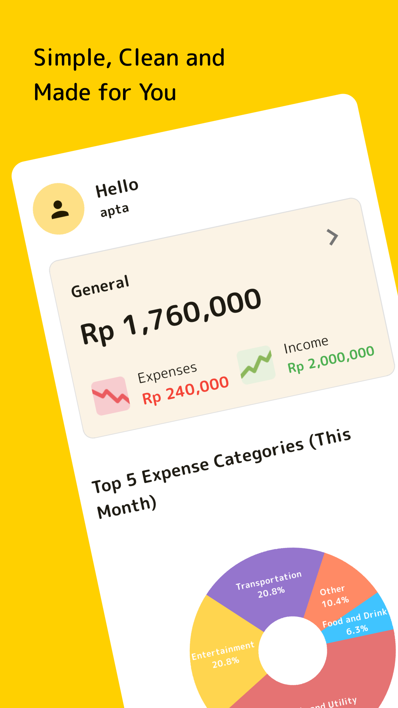
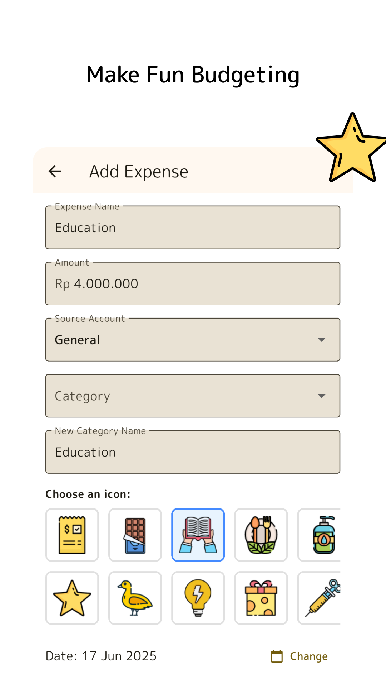
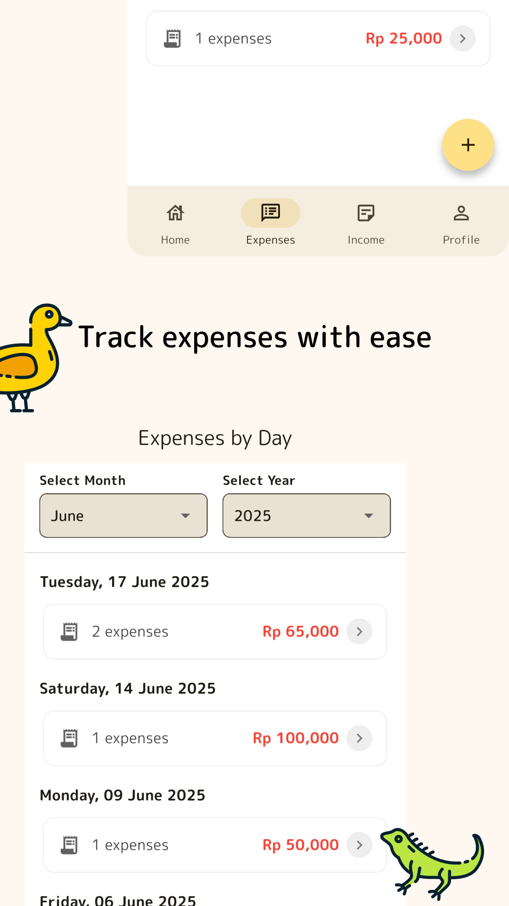

<p align="center">
  
</p>

<h1 align="center">MoneySense</h1>
<p align="center">A financial management application that helps record and monitor your daily expenses.</p>

## Table of Contents

- [Table of Contents](#table-of-contents)
- [1. Project Overview](#1-project-overview)
- [2. Screenshots](#2-screenshots)
- [3. Installation](#3-installation)
  - [Prerequisites](#prerequisites)
  - [Clone the Repository](#clone-the-repository)
  - [Run the Application](#run-the-application)
- [4. Team](#4-team)

---

## 1. Project Overview

MoneySense is a mobile solution for personal financial management. Its main features include:
- Daily income and expense recording
- Transaction categories
- Monthly graphs and summaries
- Filter by time
- Change to Another Currency

## 2. Screenshots

Here's a look at the MoneySense app:






## 3. Installation

### Prerequisites

Before started, make sure you have installed:

- [Flutter SDK 3.32.0](https://docs.flutter.dev/get-started/install/windows/mobile)
- Git
- Android Studio or VS Code
- Android Emulator

### Clone the Repository

```bash
git clone https://github.com/lyfesan/fp_ppb.git
cd fp_ppb
```
### Run the Application

```bash
flutter pub get
flutter run
```

## 4. Team

**Team Name:** PPB Sybal

- **Alief Gilang Permana Putra** – *5025221193*
  - Firebase Auth 
  - CRUD User 
  - CRUD Budget Account
  - Crashlytics
  - API Currency

- **Putu Indra Mahendra** – *5025221215*
  - CRUD Category Expenses
  - CRUD Category Income
  - CRUD Income
  - Dashboard Home

- **Apta Rasendriya Wijaya** – *5025211139*
  - CRUD Expenses
  - CRUD Icon Category
  - Dashboard Home
  - Launcher Icon & Splash Screen
